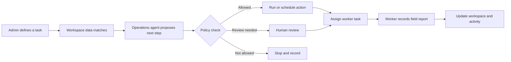
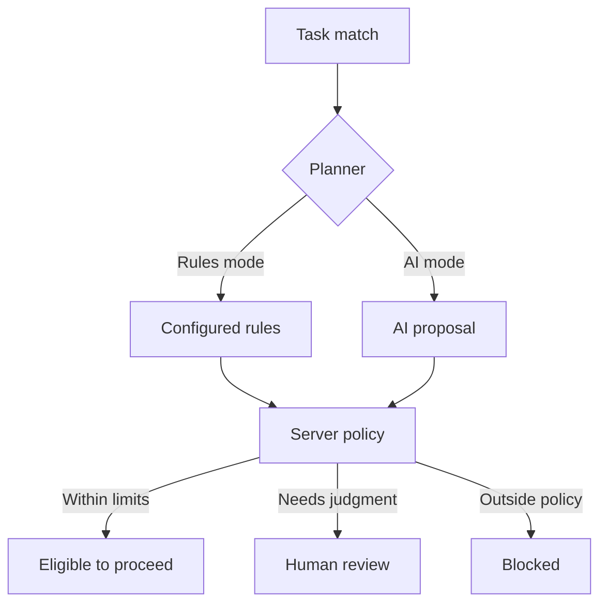
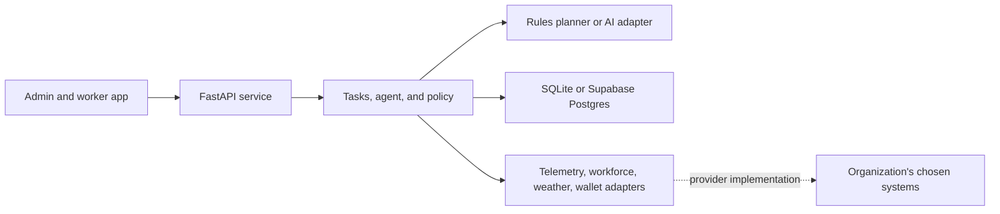

# Workkite

**Workkite turns operational signals into clear, trackable work for teams in the field.** An administrator defines what should be monitored and what action may follow. The operations agent evaluates matching records, proposes or schedules work, and sends eligible actions through fixed policy checks. Workers complete their assigned tasks—even when offline—and submit a traceable report.

Workkite is designed for organizations that operate across multiple sites and need routine work to move quickly without giving automation unchecked authority. Solar-farm examples are included, but tasks, conditions, actions, and report fields are workspace data, so the same workflow can be configured for other industries.

## Goals

- **Reduce routine coordination.** Turn changing workspace data into proposed actions, scheduled work, and worker assignments.
- **Keep people in control.** Enforce spending, supplier, destination, evidence, and approval rules outside the AI model.
- **Work in the field.** Make worker tasks readable and usable outdoors, save reports offline, and sync safely when a connection returns.
- **Adapt to each operation.** Let administrators define task logic and connect their chosen systems without baking one industry's vocabulary into the workflow engine.

## How Workkite works

An administrator creates a task from workspace data. It can run automatically when its conditions match, or wait for a person to run it. The operations agent evaluates the task and proposes the next action. Policy decides whether that action can proceed, needs review, or must stop. Work that needs a person becomes a field assignment; reports return to the workspace and activity history.



### Automation and human control

The rules planner works without an AI API and matches administrator-defined task conditions to workspace records. When configured, the AI commander can propose how to handle an eligible case, when to schedule it, its priority, and a suitable assignee from the configured options. A separate, optional AI risk reviewer can add review friction.

The model is a planner, not the authority. It cannot change an administrator's task definition, supplier, amount, recipient, limits, or approval role. The server checks every proposal against deterministic policy. Low-risk actions can proceed only when they satisfy configured limits; exceptions go to a human; disallowed actions stop. If an AI provider is unavailable, rate-limited, or returns an invalid proposal, Workkite routes the item for human review.



In a hosted deployment, Workkite does not run a permanent background process. Configure the secured scheduled endpoint to invoke the agent regularly; otherwise saved tasks remain available, but scheduled automation does not run by itself.

### Admin and worker experience

- **Admin workspace:** see what needs attention, define and edit tasks, maintain sites and operational data, review exceptions, and manage workspace access.
- **Task builder:** choose a data source, conditions, behavior, and action. Report fields and worker task options follow the saved task definition.
- **Worker workspace:** see assigned work, identify the relevant site or asset, complete large readable controls, capture evidence, and save reports offline for later sync.
- **Activity and review:** inspect proposed, completed, blocked, and human-reviewed actions with their related field reports.
- **Connections:** record which vendors and endpoints the organization plans to use. These settings prepare the integration points; they do not by themselves create live vendor connections.

### Modular by design

The app separates workflow logic from external providers. The AI provider, data repository, telemetry feed, weather source, wallet, and other integrations sit behind server-side interfaces. Local development uses replaceable local adapters; hosted mode uses Supabase Auth and Postgres. New providers can be added by implementing the relevant adapter while keeping the task workflow and policy checks in place.



## Current capabilities and boundaries

- **Included:** React/Vite interface, FastAPI API, editable task rules, worker reports with local offline queue, local SQLite development, Supabase Auth/Postgres hosted adapter, replaceable OpenAI-compatible AI provider, and policy-checked action proposals.
- **AI is optional:** the default rules planner works without an API key. Configure a server-side key to use an AI commander. Never expose provider keys in browser variables such as `VITE_*` or commit them.
- **External connections are extension points:** telemetry/SCADA, inventory/procurement, workforce dispatch, weather, notifications, and RPC settings do not activate vendor integrations until their adapters are implemented and configured.
- **Wallet status:** a Solidity reference contract and tests are included, but it is not deployed or connected to the UI. The app does not send real blockchain transactions.
- **Evidence storage:** hosted report metadata and media are currently stored through Postgres. A private Supabase Storage bucket exists, but direct browser uploads are not wired yet; avoid relying on large photo/audio uploads at scale.

## Run locally

### Requirements

- Node.js 22.12 or newer and npm.
- Python 3.11 or newer.
- Git, if cloning the repository.

From the repository root:

```powershell
npm run setup
Copy-Item .env.example .env
```

Edit the ignored `.env` file. To start with an empty company workspace instead of the included solar starter records, set:

```dotenv
WORKKITE_LOCAL_EMPTY_WORKSPACE=true
WORKKITE_LOCAL_WORKSPACE_NAME=Your company
WORKKITE_LOCAL_USERS_JSON=[{"username":"admin","password":"change-this","role":"admin","display_name":"Workspace Admin"},{"username":"worker1","password":"change-this-too","role":"worker","display_name":"Field Worker"}]
```

Choose your own local passwords. Local username sign-in only selects a local interface role; it does **not** secure API routes. These credentials are read by the local API and are not part of the browser bundle. Never use them in a public deployment. Hosted sign-in uses Supabase Auth.

Start the frontend and API together:

```powershell
npm run dev
```

Open <http://127.0.0.1:5173>. The frontend uses loopback port 5173 and the FastAPI service uses port 8000. Stop both with **Ctrl+C**. SQLite data is stored under `apps/api/data/` and ignored by Git.

### Configure an AI provider

Add these values to the API's `.env` file to use Gemini Flash through its OpenAI-compatible endpoint:

```dotenv
WORKKITE_AGENT=ai-commander
WORKKITE_LLM_BASE_URL=https://generativelanguage.googleapis.com/v1beta/openai
WORKKITE_LLM_MODEL=gemini-flash-latest
WORKKITE_LLM_API_KEY=your-secret-key
WORKKITE_LLM_REASONING_EFFORT=none
```

For Mistral, set the base URL to `https://api.mistral.ai/v1`, use a model available to your account, and provide its key. The optional separate AI risk reviewer is enabled with `WORKKITE_RISK_REVIEWER=ai`. Keep both provider settings and secrets on the API server. See [the integration guide](docs/integrations.md) for provider behavior, limits, and how to add another adapter.

## Production deployment

The deployment target uses a Vercel project connected to this repository and a Supabase project. `vercel.json` builds the Vite app and routes `/api/*` to the FastAPI entry point at `api/index.py`. Hosted API mode uses Supabase Auth and workspace-scoped Postgres; it does not start a permanent agent loop.

1. Apply the migrations in `supabase/migrations/` to Supabase. See [the migration notes](supabase/migrations/README.md).
2. Set the Supabase Auth site URL to the deployed site and disable open self-registration. Invite the first administrator through Supabase Auth. The database bootstrap assigns the first invited account the admin role and later invited accounts the worker role.
3. Import the repository into Vercel with the repository root as the project root. Configure these environment variables in Vercel:
   - Browser Auth: `VITE_SUPABASE_URL`, `VITE_SUPABASE_PUBLISHABLE_KEY` (public publishable key).
   - API and database: `WORKKITE_ENV=production`, `SUPABASE_URL`, `SUPABASE_PUBLISHABLE_KEY`, and `SUPABASE_DATABASE_URL`. Use the Supabase transaction-pooler connection string for the serverless runtime.
   - Optional AI: `WORKKITE_AGENT=ai-commander`, `WORKKITE_LLM_BASE_URL`, `WORKKITE_LLM_MODEL`, and secret `WORKKITE_LLM_API_KEY`; optionally `WORKKITE_LLM_REASONING_EFFORT` and `WORKKITE_RISK_REVIEWER=ai`.
   - Optional scheduled automation: set a high-entropy `CRON_SECRET` in Vercel and Supabase Vault, then use Supabase Cron/`pg_net` to call `GET https://<your-domain>/api/cron/agent` each minute with `Authorization: Bearer <CRON_SECRET>`.
4. Redeploy after changing environment variables. Check `/api/health`, sign in, and verify an admin-created task reaches a worker and its report returns to the workspace.

Vercel build and Supabase configuration details are in [the deployment guide](docs/deployment-vercel-supabase.md). Purchases do not move real funds until an authorized wallet/RPC adapter and transaction flow are deliberately implemented.

## Run checks

```powershell
npm run build
npm test
```

`npm test` runs the FastAPI and Solidity contract test suites. For one suite only, run `npm run test:api` or `npm run test:contracts`. The contract tests use a local development chain; the contract is not deployed by these commands.

## Repository map

```text
api/                         Vercel FastAPI entry point
apps/api/averlock/           API, policy, agent, adapters, repositories
apps/api/tests/              API and operations tests
apps/web/                    React/Vite admin and worker interface
contracts/                   Solidity wallet reference and tests
supabase/migrations/         Hosted schema, roles, and RLS migrations
deploy/vercel-supabase/       Production environment template
docs/                         Architecture, decisions, walkthrough, integrations
scripts/                      Setup, local run, tests, and build support
```

## More documentation

- [Architecture](docs/architecture.md)
- [Product brief](docs/product-brief.md)
- [Implementation decisions](docs/decisions.md)
- [Operator walkthrough](docs/operator-walkthrough.md)
- [AI and integration guide](docs/integrations.md)
- [Vercel and Supabase deployment guide](docs/deployment-vercel-supabase.md)
- [Supabase migrations](supabase/migrations/README.md)
