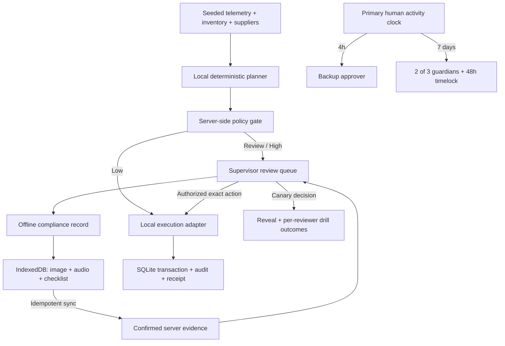

# Architecture

Averlock is a local, connector-free implementation of the field-operations scenario. The web application talks only to a loopback FastAPI service. External planning, telemetry, weather, identity, database, and blockchain services are not connected.

## Structure and boundaries

| Location                            | Responsibility                                                              |
| ----------------------------------- | --------------------------------------------------------------------------- |
| `apps/web/src/components`           | Overview, review, field console, recovery, audit                            |
| `apps/web/src/api.ts`               | All HTTP transport to the local backend                                     |
| `apps/web/src/offline.ts`           | IndexedDB queue, cached snapshot, idempotent sync                           |
| `apps/api/averlock/adapters.py`     | Planner, site-data and wallet ports; local implementations; weather port    |
| `apps/api/averlock/policy.py`       | Deterministic permission checks and explanatory severity                    |
| `apps/api/averlock/service.py`      | Atomic domain transitions, drills, decisions, recovery                      |
| `apps/api/averlock/repository.py`   | Repository protocol and SQLite adapter                                      |
| `apps/api/averlock/main.py`         | Validated local HTTP routes and dependency construction                     |
| `contracts/src/OperatingWallet.sol` | Separate reference implementation of on-chain spending and authority limits |

The frontend uses React, TypeScript, and Vite. The product brief suggested Next.js; Vite was chosen because this is an interactive local application with a separate Python backend and no server-rendering requirement. No external fonts, analytics, image services, or CDN scripts are needed at runtime.

## Authority rules

There are three routing tiers: **low**, **review**, and **high**. A hard policy block is an execution outcome, not a fourth tier. A heuristic score explains routing and has no power to authorize payment.

- Agent: approved supplier and recipient, at most $250 per action and $1,000 per UTC day.
- Supervisor or eligible backup: at most $5,000 per action; a single supervisor can approve the $4,700 replacement.
- Inverter replacement: confirmed positive field evidence is required before approval.
- Canary: never executable, even if approved. The wallet adapter has a second explicit guard.
- Repeated real execution is rejected; a receipt is created once.

The local planner compares supplier price **and** lead time against the maintenance date. The cheaper six-day supplier loses to an approved two-day supplier. Other scenario proposals are explicit fixtures, not LLM output.

## Review drills

The program must be announced and enabled before insertion. Each newly planned action has a 3% insertion probability, approximately a 2.9% long-run share of resulting items. A labeled demonstration control inserts a drill on demand so judging does not depend on randomness. The four-action fixture is deliberately small; its observed fraction is not a statistically meaningful sampling estimate.

The current exercise changes `vendor-a` to `vend0r-a`. The request is revealed immediately after rejection or approval. The server stores caught/missed outcomes per simulated reviewer. A miss requires exact destination readback on subsequent approvals; two caught exercises restore normal friction. These are transparent training outcomes, not a validated psychological attention score. The demo does not claim to detect fatigue from click timing.

## Availability and recovery

Only an accepted primary-supervisor decision refreshes the primary clock; agent execution and backup decisions do not. A failed decision rolls back without refreshing it. The frontend labels these as simulated signatures. The Solidity version authenticates callers using `msg.sender`.

After four hours without primary activity, the backup becomes eligible to approve pending requests under the same evidence and spending limits. After seven days, an explicit guardian recovery may begin. Two distinct guardian approvals start a 48-hour delay. The owner may cancel; finalization changes the supervisor and preserves the wallet balance. No periodic check-in task is required.

Demo clock controls exist only in the local simulator. The smart contract uses block timestamps and has no function to skip time. Its tests accelerate a private in-process EVM only.

## Offline compliance

The browser commits records to IndexedDB before saying they are saved. Records include a UUID, equipment ID, fault observation, three compliance observations, capture timestamp, required image, and optional voice/text note. Photos and audio are limited to 2.8 MB each in the UI; backend payload fields are bounded too. The server assigns a separate confirmation timestamp.

Sync retries reuse the UUID. An identical retry succeeds without duplicate evidence or audit events. A changed payload with the same UUID is rejected. An unsent record remains locally saved when sync fails. Updating evidence invalidates any previous local approvals. The supervisor can inspect the latest image/audio and checklist directly in the review card.

The production service worker precaches the built application shell; API responses are not cached by the worker. The site snapshot and records live in IndexedDB. The development server supports report persistence but does not register the production service worker.

## Important limits of this build

The local HTTP service is intentionally an unauthenticated demo bound to `127.0.0.1`. Role dropdowns, guardian buttons, clock advances, sample evidence, and wallet payments are simulations. They must not be exposed as a production authorization system.

SQLite stores a single atomic state document for simplicity. Use relational tables, identity-scoped access, and append-only audit storage when integrating a real database. Media is embedded for this small demo; move it to authenticated object storage for production. Neither the prototype nor sample evidence certifies workplace safety or regulatory compliance.

The Solidity wallet is independently tested but not wired to the UI and is not audited. The contract prevents an agent key from bypassing its immutable financial limits; it cannot itself determine whether a photo proves an equipment fault or whether a human paid attention. That evidence binding needs an authenticated integration before live use.
