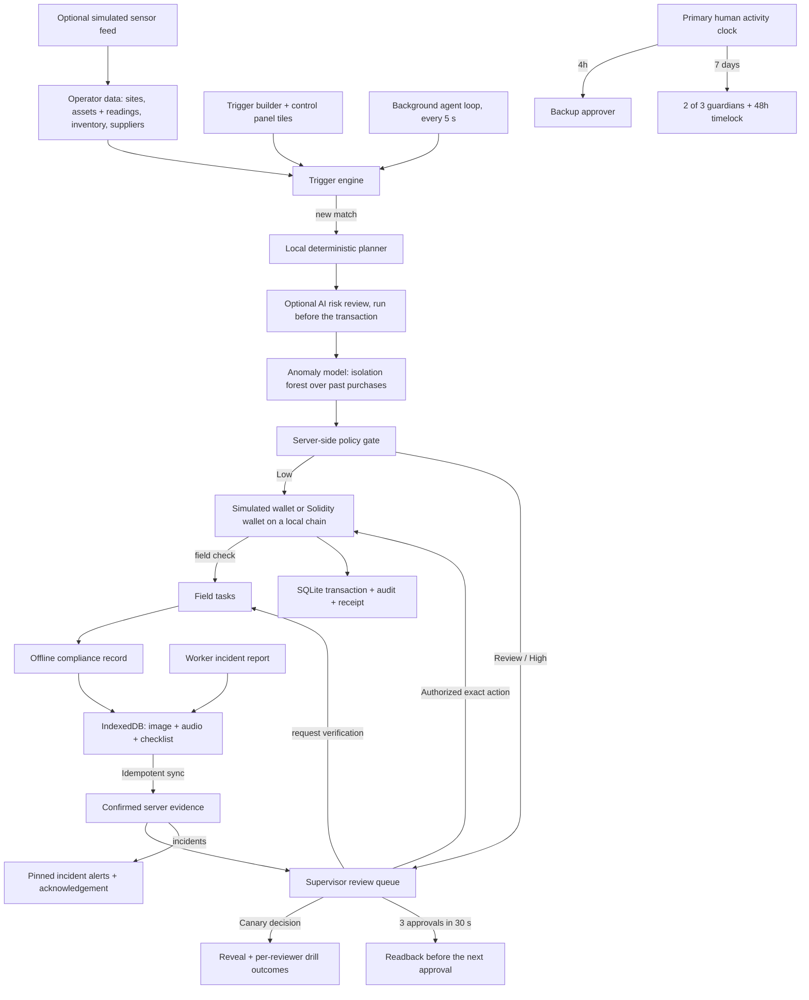

# Architecture

Workkite is a local operations control plane. Operators keep site data in the workspace, define triggers over it, and a background agent turns matches into proposals that pass through one deterministic policy gate. The web application talks only to a loopback FastAPI service. Two optional adapters can be switched on: an OpenAI-compatible AI risk reviewer (`WORKKITE_AGENT=ai-risk`) and the Solidity wallet on a local Hardhat devnet (`npm run dev:chain`). A workspace-trained anomaly model runs locally with no key. Telemetry, weather, identity, and database services are not connected.

## Structure and boundaries

| Location                                     | Responsibility                                                                 |
| -------------------------------------------- | ------------------------------------------------------------------------------ |
| `apps/web/src/components/ControlPanel.tsx`   | Incidents, review queue, automatic-vs-human KPIs, rule tiles, simulation panel |
| `apps/web/src/components/TriggerBuilder.tsx` | Field/operator/value conditions, actions, worker fields, live preview          |
| `apps/web/src/components/Incidents.tsx`      | Worker incident reporting, incident history, supervisor alerts                 |
| `apps/web/src/components/DataPage.tsx`       | Operator data editor: assets and readings, inventory, suppliers, sites         |
| `apps/web/src/components`                    | Review, field console, recovery, audit                                         |
| `apps/web/src/api.ts`                        | All HTTP transport to the local backend                                        |
| `apps/web/src/offline.ts`                    | IndexedDB queue, cached snapshot, idempotent sync                              |
| `apps/api/averlock/triggers.py`              | Field schema inferred from data, condition evaluation, draft validation        |
| `apps/api/averlock/adapters.py`              | Planner, wallet, and sensor-feed ports; local implementations; weather port    |
| `apps/api/averlock/policy.py`                | Deterministic permission checks and explanatory severity                       |
| `apps/api/averlock/anomaly.py`               | Isolation forest and per-item baselines trained on the workspace's purchases   |
| `apps/api/averlock/chain.py`                 | JSON-RPC adapter that runs the Solidity wallet on a local Hardhat node         |
| `apps/api/averlock/service.py`               | Agent cycle, atomic domain transitions, drills, decisions, recovery            |
| `apps/api/averlock/repository.py`            | Repository protocol and SQLite adapter (state document + evidence media table) |
| `apps/api/averlock/main.py`                  | Validated local HTTP routes, background loop, dependency construction          |
| `contracts/src/OperatingWallet.sol`          | On-chain spending, backup, rotation, and recovery limits (optional local chain) |

The frontend uses React, TypeScript, and Vite. The product brief suggested Next.js; Vite was chosen because this is an interactive local application with a separate Python backend and no server-rendering requirement. No external fonts, analytics, image services, or CDN scripts are needed at runtime.

## Triggers and the background agent

A trigger has a data source (assets or inventory), a site scope, one to six typed conditions joined by _all_ or _any_, an action, and a cooldown. The builder's field list is inferred from the records in the workspace, so a reading an operator adds to any asset becomes a trigger field immediately. The server validates every draft against the live schema: unknown fields, operators that do not fit the field type, unparseable values, unknown sites, and incomplete actions are rejected.

Actions are deliberately few: raise an alert, create a work order, restock inventory, request a field check, or propose a fixed purchase. A purchase may require a technician's on-site confirmation before any approval is possible. Text templates can insert `{name}`, `{code}`, and `{site}` from the matched record.

For field checks and field-gated purchases, admins can define up to twelve worker report prompts as short text, number, or yes/no fields, each with a required flag. A dispatched task carries a snapshot of its configured form; the API rejects unrequested keys, missing required answers, and invalid response types. The Worker view hides the admin navigation and remains in high-contrast outdoor mode, with large targets, equipment-ID readback, hold-to-save, and the offline report queue.

The agent loop runs inside the API process (`WORKKITE_AGENT_INTERVAL`, default 5 s; `0` disables it). Each cycle optionally applies the simulated sensor feed, then evaluates every enabled automatic trigger. Evaluation is **edge-triggered**: a record fires when it starts matching, never twice while it keeps matching, and at most once per cooldown window after it clears. A record with an open item from the same trigger (a pending decision or an open field task) never fires again, so a rejected proposal stays rejected until its condition clears. Records resolved by the action itself, such as a completed restock, re-arm within the same cycle. Manual triggers are runbooks: they appear as buttons on the control panel and fire for every current match when pressed, skipping records that already have open items.

A trigger never executes anything itself. The planner turns each match into a proposal, and the policy gate alone decides what runs. The restock planner compares approved suppliers' price and lead time against the site's next visit, so a cheaper six-day supplier loses to an approved two-day supplier when the visit is in three days.

## Authority rules

There are three routing tiers: **low**, **review**, and **high**. A hard policy block is an execution outcome, not a fourth tier. A heuristic score explains routing and has no power to authorize payment.

- Agent: approved supplier and known recipient, at most $250 per action and $1,000 per budget day. Budget days follow the simulation clock, so a fast-forwarded week has seven.
- Supervisor or eligible backup: at most $5,000 per action; a single supervisor can approve the $4,700 replacement.
- A stand-in backup may approve at most $5,000 in total while the owner is away. The allowance resets only when the owner acts again or recovery installs a new owner, so a backup key cannot drain the wallet one day at a time.
- A purchase at least three times the typical site purchase is flagged with its multiple.
- The anomaly model and the optional AI reviewer can only add friction: a flag sends a purchase to a person even inside every limit, and nothing they say can approve anything.
- Purchases marked for field confirmation require a confirmed on-site answer before approval.
- Only purchases can move funds; any other action with an amount is blocked.
- Editing a supplier's payment destination makes it a new destination: the agent cannot pay it autonomously.
- Canary: never executable, even if approved. The wallet adapter has a second explicit guard.
- Repeated real execution is rejected; a receipt is created once, and executed actions are credited to the person who authorized them.

## Anomaly model

`anomaly.py` trains an isolation forest (Liu, Ting and Zhou, 2008) on this workspace's own purchase history: quantity, unit price and reorder gap relative to each item's usual, plus how familiar the destination, supplier and item are. Per-item baselines run alongside it and explain themselves ("Unit price 32% above usual", "Reordered after 1.0 days; usual gap 4 days", "First payment to vendor-c-new"). New workspaces are seeded with 120 days of history generated by the same usage-and-reorder rule the agent follows; every executed purchase is added afterwards, and the model retrains when the history changes (about 25 ms). Routine restocks score well below the threshold; spikes, price changes, new destinations and bursts are escalated with their reason.

## Time-lapse

The simulation panel fast-forwards 1, 7 or 30 days of normal operations an hour at a time: steady consumption at each item's daily rate, rare spikes that stand in for leaks or theft, drifting readings, and simulated technicians closing work orders. Every proposal crosses the same policy gate and anomaly model; simulated hours use the local planner only. A typical month of the seeded workspace ends with 30–40 routine actions handled autonomously and 2–4 routed to people, which is the approval-fatigue claim made measurable.

## Review drills and pace checks

The program must be announced and enabled before insertion. Each newly planned action has a 3% insertion probability, approximately a 2.9% long-run share of resulting items. A labeled demonstration control inserts a drill on demand so judging does not depend on randomness.

A drill is written by the same local planner as a real restock (quantity, supplier choice, and explanation), for an item with no order already waiting, but pays a lookalike destination (for example `vend0r-a` instead of `vendor-a`). The expected destination is hidden while the item is pending and revealed immediately after rejection or approval. The server stores caught/missed outcomes per simulated reviewer. A miss requires exact destination readback on subsequent approvals; two caught exercises restore normal friction. These are transparent training outcomes, not a validated psychological attention score.

Separately, three approvals by the same person inside 30 seconds make the next approval require typing the payment destination (or the equipment code for non-payments). Rejections are never slowed down. The review page shows the readback field only when it is required.

## Availability and recovery

Only an accepted primary-supervisor decision refreshes the primary clock; agent execution and backup decisions do not. A failed decision rolls back without refreshing it. The frontend labels these as simulated signatures. The Solidity version authenticates callers using `msg.sender`.

After four hours without primary activity, the backup becomes eligible to approve pending requests under the same evidence and spending limits, up to $5,000 in total for the absence. After seven days, an explicit guardian recovery may begin. Two distinct guardian approvals start a 48-hour delay. The owner may cancel; finalization changes the supervisor and preserves the wallet balance. Recovery can run again later: authority passes to the other designated supervisor, never to a guardian or the backup. No periodic check-in task is required.

Demo clock controls exist only in the local simulator (Access page). On the local chain they also advance the devnet with `evm_increaseTime`, so the contract's own clocks agree with the workspace. The smart contract uses block timestamps and has no function to skip time.

## Local chain

With `WORKKITE_WALLET=local-chain`, `chain.py` deploys a demo six-decimal token and the `OperatingWallet` to a local Hardhat node, funds it with the workspace balance, and allows the known supplier destinations. Autonomous purchases are sent from the agent key with `executeAgent`; approved purchases from the approving supervisor or backup with `executeSupervisor`; primary-owner decisions call `recordDecision`; recovery steps call the guardian functions. The contract enforces the limits a second time: a payment the workspace should never have allowed is still refused on chain, and its revert reason is shown. Payment destinations are deterministic addresses derived from supplier recipient names. Transactions are sent from the node's unlocked development accounts, and RPC calls happen inside the workspace transaction; both are acceptable only for a local devnet. If a payment reached the chain but the workspace transaction did not commit, the next attempt finds the action ID already used on chain and reconciles the original transaction instead of paying twice.

## Incidents

Workers can report an unscheduled incident — injury, heat illness, fire, electrical, spill, security, other — with a severity, an optional note and photo, and an optional location. Reports use the same local-first queue as task reports and sync ahead of them, with the same idempotent retry semantics. Open incidents are pinned at the top of the Overview, most severe first, until a supervisor acknowledges them; the worker's device shows the acknowledgement on its next sync. The form tells workers to call emergency services first: it alerts supervisors and does not replace an emergency call.

## Offline compliance

Field tasks come from two places: a trigger whose action is a field check, or a supervisor requesting verification on a gated purchase. Each task carries its question and the equipment code the technician must match.

The browser commits records to IndexedDB before saying they are saved. Records include a UUID, the task ID, the yes/no answer, configured typed responses, equipment code, three compliance observations, capture timestamp, required image, and optional voice/text note. Photos are resized and compressed in the browser to fit the bounded request; audio is limited to 2.8 MB. The server assigns a separate confirmation timestamp.

Sync retries reuse the UUID. An identical retry succeeds without duplicate evidence or audit events. A changed payload with the same UUID is rejected. An unsent record remains locally saved when sync fails. New evidence invalidates any previous approvals on the linked action. Evidence media is stored in its own SQLite table, fingerprinted with SHA-256 in the state document, and served from `/api/reports/{id}/media/{kind}`, so the state the UI polls every few seconds stays small.

The production service worker precaches the built application shell; API responses are not cached by the worker. The site snapshot and records live in IndexedDB. The development server supports report persistence but does not register the production service worker.

## Important limits of this build

The local HTTP service binds to `127.0.0.1`. Local sign-in reads role assignments from API-host configuration, but API routes remain unauthenticated and the local payment and synthetic-data adapters are not production integrations. Do not expose this service publicly until verified identity and authorization protect every route.

SQLite stores a single atomic state document for simplicity, trimmed to the most recent 300 actions and 400 audit events (pending items are always kept). Use relational tables, identity-scoped access, and append-only audit storage when integrating a real database. Media belongs in authenticated object storage in production. Neither the prototype nor sample evidence certifies workplace safety or regulatory compliance.

The Solidity wallet is tested and can drive the UI on a local devnet, but it is not audited and the local adapter is not key management. The contract prevents an agent key from bypassing its immutable financial limits; it cannot itself determine whether a photo proves an equipment fault or whether a human paid attention. That evidence binding needs an authenticated integration before live use.

