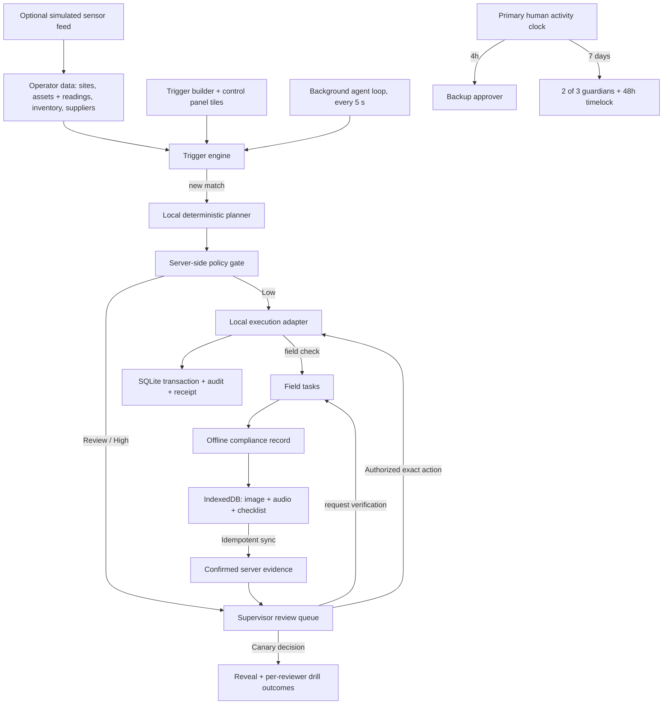

# Architecture

Averlock is a local, connector-free operations control plane. Operators keep site data in the workspace, define triggers over it, and a background agent turns matches into proposals that pass through one deterministic policy gate. The web application talks only to a loopback FastAPI service. External planning, telemetry, weather, identity, database, and blockchain services are not connected.

## Structure and boundaries

| Location                                     | Responsibility                                                                 |
| -------------------------------------------- | ------------------------------------------------------------------------------ |
| `apps/web/src/components/ControlPanel.tsx`   | Agent status, KPIs, site strip, one live tile per trigger                      |
| `apps/web/src/components/TriggerBuilder.tsx` | Templates, field/operator/value conditions, actions, server-evaluated preview  |
| `apps/web/src/components/DataPage.tsx`       | Operator data editor: assets and readings, inventory, suppliers, sites         |
| `apps/web/src/components`                    | Review, field console, recovery, audit                                         |
| `apps/web/src/api.ts`                        | All HTTP transport to the local backend                                        |
| `apps/web/src/offline.ts`                    | IndexedDB queue, cached snapshot, idempotent sync                              |
| `apps/api/averlock/triggers.py`              | Field schema inferred from data, condition evaluation, draft validation        |
| `apps/api/averlock/adapters.py`              | Planner, wallet, and sensor-feed ports; local implementations; weather port    |
| `apps/api/averlock/policy.py`                | Deterministic permission checks and explanatory severity                       |
| `apps/api/averlock/service.py`               | Agent cycle, atomic domain transitions, drills, decisions, recovery            |
| `apps/api/averlock/repository.py`            | Repository protocol and SQLite adapter (state document + evidence media table) |
| `apps/api/averlock/main.py`                  | Validated local HTTP routes, background loop, dependency construction          |
| `contracts/src/OperatingWallet.sol`          | Separate reference implementation of on-chain spending and authority limits    |

The frontend uses React, TypeScript, and Vite. The product brief suggested Next.js; Vite was chosen because this is an interactive local application with a separate Python backend and no server-rendering requirement. No external fonts, analytics, image services, or CDN scripts are needed at runtime.

## Triggers and the background agent

A trigger has a data source (assets or inventory), a site scope, one to six typed conditions joined by _all_ or _any_, an action, and a cooldown. The builder's field list is inferred from the records in the workspace, so a reading an operator adds to any asset becomes a trigger field immediately. The server validates every draft against the live schema: unknown fields, operators that do not fit the field type, unparseable values, unknown sites, and incomplete actions are rejected.

Actions are deliberately few: raise an alert, create a work order, restock inventory, request a field check, or propose a fixed purchase. A purchase may require a technician's on-site confirmation before any approval is possible. Text templates can insert `{name}`, `{code}`, and `{site}` from the matched record.

The agent loop runs inside the API process (`AVERLOCK_AGENT_INTERVAL`, default 5 s; `0` disables it). Each cycle optionally applies the simulated sensor feed, then evaluates every enabled automatic trigger. Evaluation is **edge-triggered**: a record fires when it starts matching, never twice while it keeps matching, and at most once per cooldown window after it clears. A record with an open item from the same trigger (a pending decision or an open field task) never fires again, so a rejected proposal stays rejected until its condition clears. Records resolved by the action itself, such as a completed restock, re-arm within the same cycle. Manual triggers are runbooks: they appear as buttons on the control panel and fire for every current match when pressed, skipping records that already have open items.

A trigger never executes anything itself. The planner turns each match into a proposal, and the policy gate alone decides what runs. The restock planner compares approved suppliers' price and lead time against the site's next visit, so a cheaper six-day supplier loses to an approved two-day supplier when the visit is in three days.

## Authority rules

There are three routing tiers: **low**, **review**, and **high**. A hard policy block is an execution outcome, not a fourth tier. A heuristic score explains routing and has no power to authorize payment.

- Agent: approved supplier and known recipient, at most $250 per action and $1,000 per UTC day.
- Supervisor or eligible backup: at most $5,000 per action; a single supervisor can approve the $4,700 replacement.
- A purchase at least three times the typical site purchase is flagged with its multiple.
- Purchases marked for field confirmation require a confirmed on-site answer before approval.
- Only purchases can move funds; any other action with an amount is blocked.
- Editing a supplier's payment destination makes it a new destination: the agent cannot pay it autonomously.
- Canary: never executable, even if approved. The wallet adapter has a second explicit guard.
- Repeated real execution is rejected; a receipt is created once, and executed actions are credited to the person who authorized them.

## Review drills

The program must be announced and enabled before insertion. Each newly planned action has a 3% insertion probability, approximately a 2.9% long-run share of resulting items. A labeled demonstration control inserts a drill on demand so judging does not depend on randomness.

A drill imitates a routine restock from an approved supplier, with the same ID format and explanation style as real proposals, but pays a lookalike destination (for example `vend0r-a` instead of `vendor-a`). The expected destination is hidden while the item is pending and revealed immediately after rejection or approval. The server stores caught/missed outcomes per simulated reviewer. A miss requires exact destination readback on subsequent approvals; two caught exercises restore normal friction. These are transparent training outcomes, not a validated psychological attention score.

## Availability and recovery

Only an accepted primary-supervisor decision refreshes the primary clock; agent execution and backup decisions do not. A failed decision rolls back without refreshing it. The frontend labels these as simulated signatures. The Solidity version authenticates callers using `msg.sender`.

After four hours without primary activity, the backup becomes eligible to approve pending requests under the same evidence and spending limits. After seven days, an explicit guardian recovery may begin. Two distinct guardian approvals start a 48-hour delay. The owner may cancel; finalization changes the supervisor and preserves the wallet balance. No periodic check-in task is required.

Demo clock controls exist only in the local simulator. The smart contract uses block timestamps and has no function to skip time. Its tests accelerate a private in-process EVM only.

## Offline compliance

Field tasks come from two places: a trigger whose action is a field check, or a supervisor requesting verification on a gated purchase. Each task carries its question and the equipment code the technician must match.

The browser commits records to IndexedDB before saying they are saved. Records include a UUID, the task ID, the yes/no answer, equipment code, three compliance observations, capture timestamp, required image, and optional voice/text note. Photos and audio are limited to 2.8 MB each in the UI; backend payload fields are bounded too. The server assigns a separate confirmation timestamp.

Sync retries reuse the UUID. An identical retry succeeds without duplicate evidence or audit events. A changed payload with the same UUID is rejected. An unsent record remains locally saved when sync fails. New evidence invalidates any previous approvals on the linked action. Evidence media is stored in its own SQLite table, fingerprinted with SHA-256 in the state document, and served from `/api/reports/{id}/media/{kind}`, so the state the UI polls every few seconds stays small.

The production service worker precaches the built application shell; API responses are not cached by the worker. The site snapshot and records live in IndexedDB. The development server supports report persistence but does not register the production service worker.

## Important limits of this build

The local HTTP service is intentionally an unauthenticated demo bound to `127.0.0.1`. Role dropdowns, guardian buttons, clock advances, sample evidence, the sensor feed, and wallet payments are simulations. They must not be exposed as a production authorization system.

SQLite stores a single atomic state document for simplicity, trimmed to the most recent 300 actions and 400 audit events (pending items are always kept). Use relational tables, identity-scoped access, and append-only audit storage when integrating a real database. Media belongs in authenticated object storage in production. Neither the prototype nor sample evidence certifies workplace safety or regulatory compliance.

The Solidity wallet is independently tested but not wired to the UI and is not audited. The contract prevents an agent key from bypassing its immutable financial limits; it cannot itself determine whether a photo proves an equipment fault or whether a human paid attention. That evidence binding needs an authenticated integration before live use.
